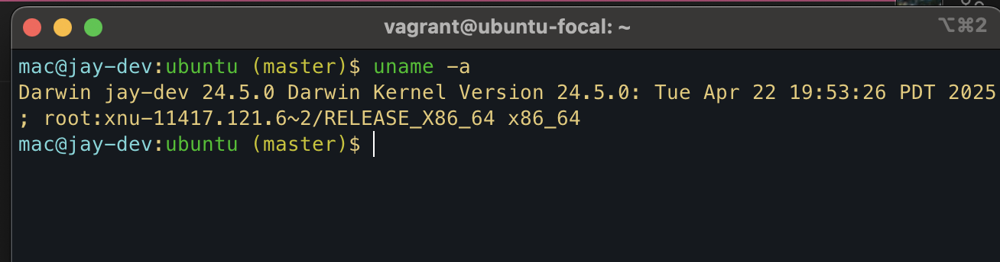
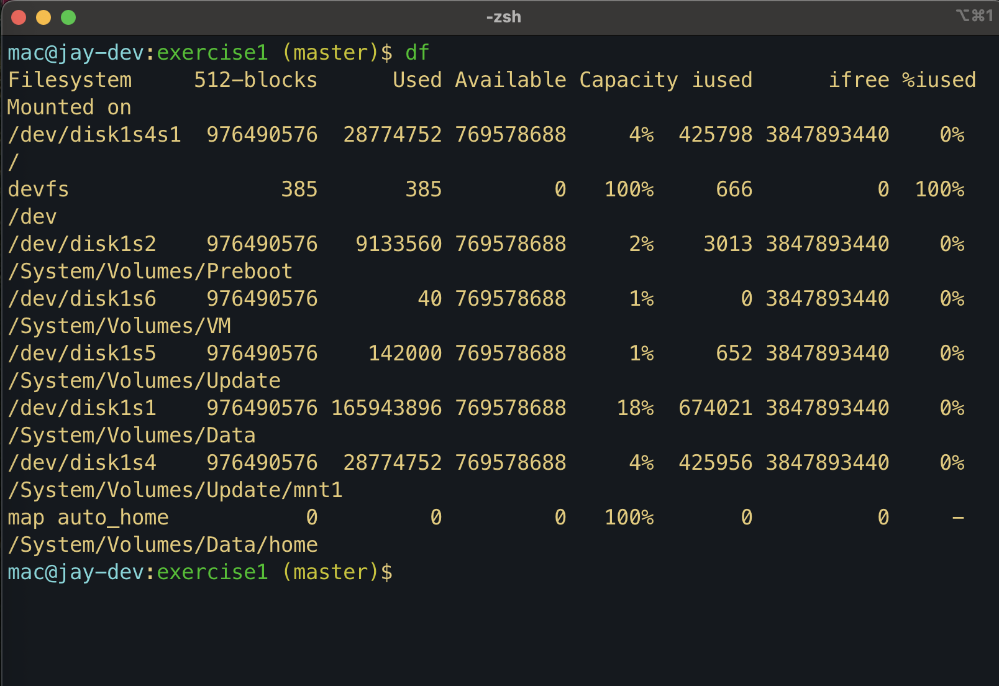
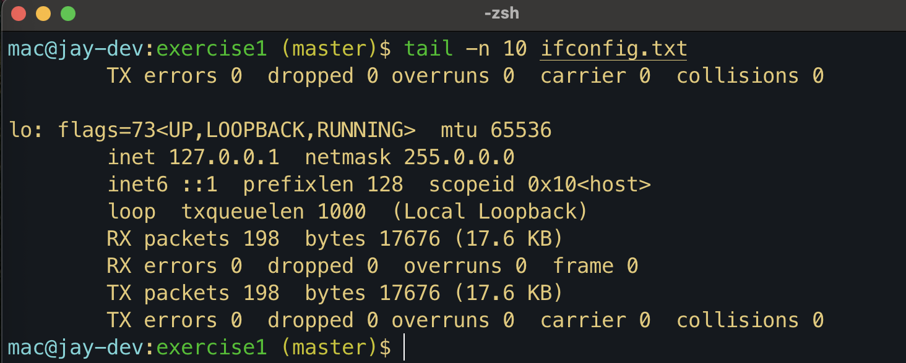

# Exercise 2: Research 10 Additional Linux Commands

## Steps:

1. **Researched 10 new Linux commands** not covered in the module.
2. **Explained each command** with usage examples.
3. **Captured screenshots** of the commands in action.
4. **Embedded screenshots** in a markdown file.
5. **Submitted the work** in the `altschool-cloud-exercises` project folder.

## Files Included:

- **Markdown file** with explanations, examples, and screenshots.

This exercise helped expand my knowledge of Linux commands.

# Linux Command Usage

## 1. `uname` - Print System Information

The `uname` command provides system information such as the kernel name, version, and machine architecture.

### Usage:



## 2. `df`

Used to show information about the disk space usage



## 3. `ps`

```bash
Used to check running processes
```



